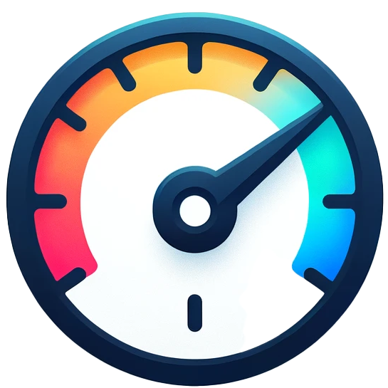

#  Browser Extension Blueprint for Measuring and Manipulating Twitter/X Activities

This repository provides a simplified blueprint for a browser extension designed to measure activities on Twitter/X and manipulate the feed in real-time.

**Compatibility:** Chrome and Edge.

---

## Overview

This project comprises two main components:

1. **Browser Extension (Frontend):**
   - The browser extension is responsible for intercepting the Twitter/X feed and modifying the content displayed to the user. This example shows how to achieve this by intercepting network requests.
   - Key files include:
     - `events.js`: Manages user interactions and event handling within the extension.
     - `logic.js`: Contains the core logic for re-ranking and modifying the feed. This example sends the content to the server for re-ranking.
     - `injected.js`: Injects custom scripts into the Twitter/X web page to override XMLHttpRequest behavior.
     - `launcher.js`: Initializes the extension and sets up necessary configurations.
     - `libs/`: Contains utility scripts and libraries, such as jQuery, to support the extension's functionality.

2. **Backend:**
   - The backend component handles processing tasks such as scoring and re-ranking posts. It manages data storage and communication with the frontend.

---

## How to Use

1. **Installation:**
   - Clone this repository and load the `BrowserExtension` folder as an unpacked extension in your Chrome or Edge browser.

2. **Backend Setup:**
   - Set up a Python environment and install the necessary dependencies with `pip install -r requirements.txt`. Start the server with `python main.py`. In production, we recommend using a WSGI server (e.g., Gunicorn). In this implementation, the server is minimal and can be easily ported to other languages.

3. **Running the Extension:**
   - Once installed, the extension will automatically intercept your Twitter/X feed and apply the configured interventions. Use the console logs to monitor the intercepted events.

### Logged Events in `events.js`

- **CreateTweet:** Logged when a user creates a new tweet.
- **LinkClick:** Logged when a user clicks on a link.
- **CreateRetweet:** Logged when a user retweets a post.
- **FavoriteTweet:** Logged when a user favorites (likes) a tweet.
- **TweetVisible:** Logged when a tweet becomes visible in the viewport.
- **TweetVisible1Sec:** Logged when a tweet remains visible for 1 second.
- **TweetVisible3Sec:** Logged when a tweet remains visible for 3 seconds.
- **RenderedTweets:** Logged when tweets are rendered in the feed (added to the DOM).
- **Alive:** Logged as a heartbeat event every minute to indicate the extension is active.
- **UserLeaveTab:** Logged when the user leaves the current tab.
- **UserReturnOnTab:** Logged when the user returns to the tab.
- **PageUnload:** Logged when the page is about to be unloaded.
- **UrlChange:** Logged when the URL changes, indicating navigation within the site.

---

## Paper Reference

Refer to this article for more information:

**Reranking Social Media Feeds: A Practical Guide for Field Experiments**

*Social media plays a central role in shaping public opinion and behavior, yet performing experiments on these platforms and, in particular, on feed algorithms is becoming increasingly challenging. This article offers practical recommendations to researchers developing and deploying field experiments focused on real-time re-ranking of social media feeds. The article is organized around two main contributions:*

1. *An overview of an experimental method using web browser extensions that intercept and re-rank content in real-time, enabling naturalistic re-ranking field experiments on participants' actual feeds, without requiring the involvement of social media platforms.*

2. *Concrete technical recommendations for intercepting and re-ranking social media feeds with minimal user-facing delay, along with an open-source implementation. This document aims to summarize lessons learned, provide concrete implementation details, and foster the ecosystem of independent social media research.*

*Tiziano Piccardi, Martin Saveski, Chenyan Jia, Jeffrey Hancock, Jeanne L. Tsai, Michael S. Bernstein*

Read the full paper [here](https://arxiv.org/abs/2406.19571).

### Please cite as:
```@article{piccardi2024reranking,
  title={Reranking Social Media Feeds: A Practical Guide for Field Experiments},
  author={Piccardi, Tiziano and Saveski, Martin and Jia, Chenyan and Hancock, Jeffrey and Tsai, Jeanne L and Bernstein, Michael S},
  journal={arXiv preprint arXiv:2406.19571},
  year={2024}
}```
